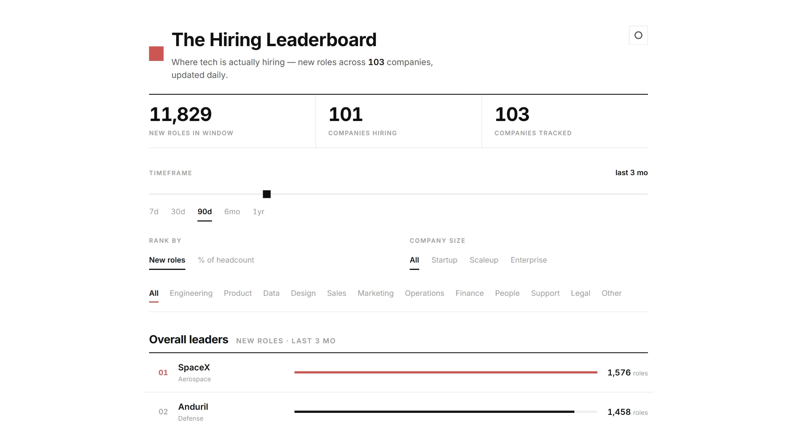

# The Hiring Leaderboard

**See where tech is actually hiring — live.** A single, self-updating view of hiring *momentum*: which companies are opening the most new roles right now, by function and relative to their size.

[](https://github.com/davidyangHY/hiring-leaderboard/actions/workflows/daily-snapshot.yml)


### ▶ [**Live demo → hiring-leaderboard.vercel.app**](https://hiring-leaderboard.vercel.app/)



---

## Overview

Job boards show you *listings*. The Hiring Leaderboard shows you **momentum** — it turns 100+ company job boards into one ranked, filterable view of who's actually ramping up. Pick a timeframe and see which companies posted the most new roles, drill into any company to see the roles by seniority, and rank by raw count or **as a share of headcount** so a fast-growing startup can out-rank a giant.

Built for job seekers deciding where to aim, and anyone tracking hiring as a signal of who's scaling.

## Features

- **New-roles leaderboard** over any timeframe — drag the slider from 7 days to a year
- **Filter** by function (Engineering, Product, Data, Design, …) and company size (startup → enterprise)
- **Rank by raw count or % of headcount** — who's growing fastest for their size
- **Company drill-down** — click any company for its open roles, grouped by seniority, each linking to the live posting
- **Self-updating** — a daily pipeline refreshes everything with zero manual work

## How it works

```
100+ job boards → normalize → classify → daily snapshot (CDC) → dbt models → static JSON → site
```

| Stage | What happens | Tech |
|-------|--------------|------|
| **Ingest** | Fetch open roles from each company's board through one pluggable adapter | `requests`, Greenhouse / Lever / Ashby APIs |
| **Classify** | Map each role's title + department to a function and seniority | Python (ordered keyword rules) |
| **Capture** | Store a dated daily snapshot; a role is "new" the first day its ID appears (change-data-capture) | DuckDB + Parquet history |
| **Transform** | Model into staging → intermediate → marts, with data-quality tests | dbt (dbt-duckdb) |
| **Serve** | Export small static JSON the site filters entirely in-browser — no backend | vanilla JS, Vercel |
| **Orchestrate** | Run the whole thing daily and commit the refresh (auto-deploys) | GitHub Actions cron |

The business logic lives in `src/`, so the pipeline is orchestrator-agnostic — GitHub Actions runs it for free today; it would drop into Airflow unchanged if it grew to need DAG-level complexity.

## The data

- **100+ companies**, ~17,500 open roles, refreshed **every day**
- **Sources:** public applicant-tracking-system APIs — **Greenhouse, Lever, Ashby** (the same feeds their own careers pages use)
- **"New roles" via change-data-capture:** counts are derived by diffing daily snapshots, not from posting dates (which get bumped when companies re-post) — so accuracy sharpens as history accumulates. History is persisted as Parquet (source of truth); DuckDB is a derived cache.
- **Coverage caveat:** only ATS-based boards are tracked. Companies on Workday / Eightfold / custom sites (e.g. Google, Meta, Netflix, Qualcomm) are intentionally excluded — those block automated access, and the tracked set is deliberately the boards meant to be read publicly.

## Tech stack

`Python` · `DuckDB` · `dbt` · `GitHub Actions` · `Parquet` · `vanilla JS` · `Vercel`

## Run locally

```bash
pip install -r requirements.txt
python -m src.snapshot                                   # fetch + classify + snapshot
cd dbt_project && dbt build --profiles-dir . && cd ..    # model + test
python -m src.export_json                                # export JSON for the site
python -m http.server 8000 --directory web               # open http://localhost:8000
```

---

<sub><b>Note on early data:</b> until snapshot history builds up, new-role counts are estimated from posting dates and can overstate frequent re-posters; the change-data-capture signal takes over and sharpens daily.</sub>
